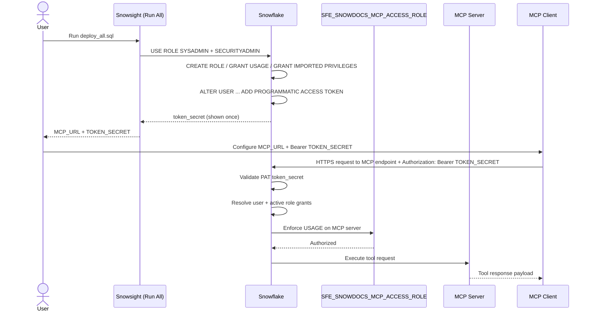

# Auth Flow - Snowdocs MCP Server
Author: SE Community
Last Updated: 2026-01-09
Expires: 2026-02-07 (30 days from creation)
Status: Reference Implementation

Reference Implementation: This code demonstrates production-grade architectural patterns and best practices. Review and customize security, networking, and logic for your organization's specific requirements before deployment.

## Overview
This diagram shows how a Programmatic Access Token (PAT) is created during deployment, how it is used by an MCP client as a bearer token, and how Snowflake RBAC enforces authorization for MCP server usage.

## Component Descriptions
- Purpose: Token issuance
- Technology: Snowflake Programmatic Access Token (PAT)
- Location: `deploy_all.sql` (PART 5)
- Deps: Token secret must be stored securely by the user; it cannot be retrieved later

- Purpose: Authorization boundary
- Technology: Snowflake RBAC via `SFE_SNOWDOCS_MCP_ACCESS_ROLE`
- Location: `deploy_all.sql` (PART 4)
- Deps: Role must have USAGE on MCP server and warehouse, plus imported privileges for `SNOWFLAKE_DOCUMENTATION`

- Purpose: Runtime enforcement
- Technology: Snowflake API layer validating bearer token and evaluating grants
- Location: Snowflake account
- Deps: Correct MCP URL, valid token, and grants

## Change History
See `.cursor/DIAGRAM_CHANGELOG.md` for vhistory.
