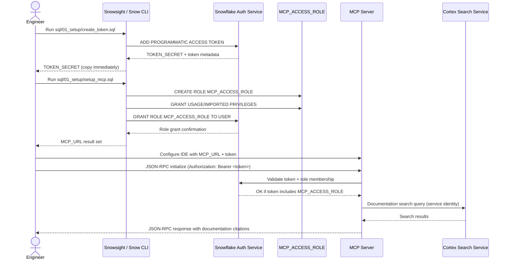

# Auth Flow - Snowflake MCP Server Setup

**Author:** SE Community
**Last Updated:** 2025-11-21
**Status:** Reference Implementation

---

⚠️ **WARNING: This is a demonstration project. NOT FOR PRODUCTION USE.**

---

## Overview

This sequence diagram documents how authentication and authorization occur during token creation, role assignment, and subsequent MCP requests from an IDE.

---

## Diagram

```mermaid
sequenceDiagram
    actor Engineer
    participant Snowsight as Snowsight / Snow CLI
    participant Auth as Snowflake Auth Service
    participant Role as MCP_ACCESS_ROLE
    participant MCP as MCP Server
    participant Cortex as Cortex Search Service

    Engineer->>Snowsight: Run sql/01_setup/create_token.sql
    Snowsight->>Auth: ADD PROGRAMMATIC ACCESS TOKEN
    Auth-->>Snowsight: TOKEN_SECRET + token metadata
    Snowsight-->>Engineer: TOKEN_SECRET (copy immediately)

    Engineer->>Snowsight: Run sql/01_setup/setup_mcp.sql
    Snowsight->>Role: CREATE ROLE MCP_ACCESS_ROLE
    Snowsight->>Role: GRANT USAGE/IMPORTED PRIVILEGES
    Snowsight->>Auth: GRANT ROLE MCP_ACCESS_ROLE TO USER
    Auth-->>Snowsight: Role grant confirmation
    Snowsight-->>Engineer: MCP_URL result set

    Engineer->>MCP: Configure IDE with MCP_URL + token
    Engineer->>MCP: JSON-RPC initialize (Authorization: Bearer <token>)
    MCP->>Auth: Validate token + role membership
    Auth-->>MCP: OK if token includes MCP_ACCESS_ROLE
    MCP->>Cortex: Documentation search query (service identity)
    Cortex-->>MCP: Search results
    MCP-->>Engineer: JSON-RPC response with documentation citations
```

---

## Component Descriptions

### Programmatic Access Token
- **Purpose:** Authenticates MCP requests via the Bearer token header.
- **Technology:** Snowflake programmatic access tokens
- **Location:** Stored with the user account that ran the setup scripts
- **Dependencies:** Valid for 365 days; inherits roles granted to the user

### MCP_ACCESS_ROLE
- **Purpose:** Constrains token permissions to documentation search only.
- **Technology:** Snowflake role with USAGE and IMPORTED PRIVILEGES grants
- **Location:** Account-level role `MCP_ACCESS_ROLE`
- **Dependencies:** Grants to databases `SNOWFLAKE_INTELLIGENCE` and `SNOWFLAKE_DOCUMENTATION`

### MCP Server
- **Purpose:** Authorizes Bearer tokens and proxies documentation search queries.
- **Technology:** Snowflake-managed MCP server
- **Location:** `SNOWFLAKE_INTELLIGENCE.MCP.SNOWFLAKE_MCP_SERVER`
- **Dependencies:** MCP_ACCESS_ROLE, Cortex Search Service, JSON-RPC requests

### Cortex Search Service
- **Purpose:** Performs documentation search and returns structured results.
- **Technology:** Snowflake Cortex Search
- **Location:** `SNOWFLAKE_DOCUMENTATION.SHARED.CKE_SNOWFLAKE_DOCS_SERVICE`
- **Dependencies:** Imported privileges granted to `MCP_ACCESS_ROLE`

---

## Change History

See `.cursor/docs/DIAGRAM_CHANGELOG.md` for version history.
