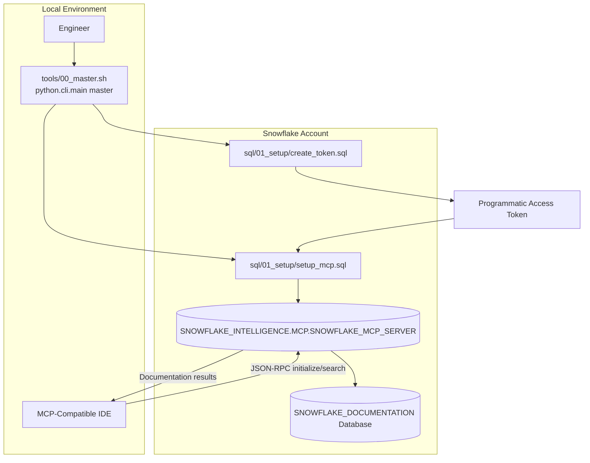

# Data Flow - Snowflake MCP Server Setup

**Author:** SE Community
**Last Updated:** 2025-11-21
**Status:** Reference Implementation

---

⚠️ **WARNING: This is a demonstration project. NOT FOR PRODUCTION USE.**

---

## Overview

This diagram shows how the provisioning scripts, local tooling, and Snowflake-managed resources exchange credentials and documentation responses to expose the Snowflake documentation corpus through an MCP-compatible client.

---

## Diagram

---

## Component Descriptions

### tools/00_master.sh / .bat
- **Purpose:** Orchestrates create-token, setup-mcp, and verification steps through a single entry point.
- **Technology:** Bash / Windows Batch invoking `python -m python.cli.main master`
- **Location:** `tools/00_master.sh`, `tools/00_master.bat`
- **Dependencies:** Python CLI modules, Snow CLI configured via profile

### python.cli.main
- **Purpose:** Provides subcommands for create-token, setup-mcp, test-connection, and master workflows.
- **Technology:** Python `argparse` and subprocess wrappers
- **Location:** `python/cli/main.py`
- **Dependencies:** `python/services/snow_cli.py`, `python/services/verification.py`, Snow CLI, `requests`

### sql/01_setup/create_token.sql
- **Purpose:** Generates a programmatic access token scoped to the current user, returning the token secret.
- **Technology:** Snowflake SQL
- **Location:** `sql/01_setup/create_token.sql`
- **Dependencies:** User with token creation privileges

### sql/01_setup/setup_mcp.sql
- **Purpose:** Accepts marketplace terms, provisions the managed MCP server, grants least-privilege access, and returns the MCP URL.
- **Technology:** Snowflake SQL, MCP server specification
- **Location:** `sql/01_setup/setup_mcp.sql`
- **Dependencies:** ACCOUNTADMIN, SYSADMIN, and SECURITYADMIN roles; Snowflake-managed databases

### SNOWFLAKE_INTELLIGENCE.MCP.SNOWFLAKE_MCP_SERVER
- **Purpose:** Exposes Snowflake documentation through Cortex Search via the MCP protocol.
- **Technology:** Snowflake-managed MCP server
- **Location:** `SNOWFLAKE_INTELLIGENCE.MCP` schema
- **Dependencies:** `SNOWFLAKE_DOCUMENTATION` database share, MCP_ACCESS_ROLE grants

### SNOWFLAKE_DOCUMENTATION Database
- **Purpose:** Provides the Cortex Search Service powering documentation retrieval.
- **Technology:** Snowflake Marketplace share
- **Location:** Account-level database `SNOWFLAKE_DOCUMENTATION`
- **Dependencies:** Accepted legal terms, imported privileges granted to `MCP_ACCESS_ROLE`

### MCP-Compatible IDE
- **Purpose:** Issues JSON-RPC requests to the MCP server and renders documentation responses for the user.
- **Technology:** Cursor, Claude Desktop, VS Code (Continue), or other MCP clients
- **Location:** Developer workstation
- **Dependencies:** MCP URL, Bearer token, configuration file updates

---

## Change History

See `.cursor/docs/DIAGRAM_CHANGELOG.md` for version history.
