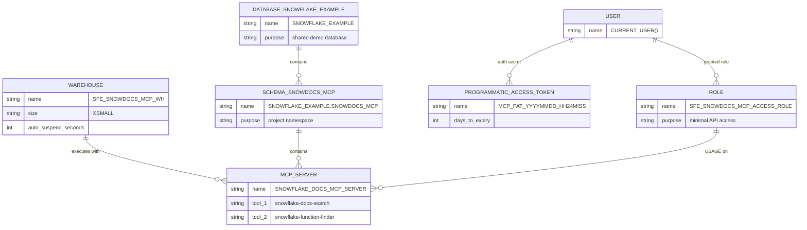

# Data Model - Snowdocs MCP Server
Author: SE Community
Last Updated: 2026-01-09
Expires: 2026-02-07 (30 days from creation)
Status: Reference Implementation

Reference Implementation: This code demonstrates production-grade architectural patterns and best practices. Review and customize security, networking, and logic for your organization's specific requirements before deployment.

## Overview
This diagram shows the Snowflake objects created by `deploy_all.sql` and how they relate to each other to expose an MCP server endpoint backed by Snowflake-managed documentation search.

## Component Descriptions
- Purpose: Snowflake Warehouse
- Technology: Snowflake virtual warehouse (`SFE_SNOWDOCS_MCP_WH`)
- Location: Created in `deploy_all.sql`
- Deps: Granted to `SFE_SNOWDOCS_MCP_ACCESS_ROLE`

- Purpose: Project schema namespace
- Technology: Snowflake database + schema (`SNOWFLAKE_EXAMPLE.SNOWDOCS_MCP`)
- Location: Created in `deploy_all.sql`
- Deps: `SFE_SNOWDOCS_MCP_ACCESS_ROLE` granted USAGE on DB/SCHEMA

- Purpose: MCP server endpoint
- Technology: Snowflake `MCP SERVER` object exposing tools
- Location: Created in `deploy_all.sql`
- Deps: Uses Snowflake-managed Cortex Search service; executed on `SFE_SNOWDOCS_MCP_WH`

- Purpose: Access role + token
- Technology: Snowflake RBAC + Programmatic Access Token (PAT)
- Location: Created/assigned in `deploy_all.sql`
- Deps: `SFE_SNOWDOCS_MCP_ACCESS_ROLE` is granted USAGE on the MCP server; PAT is added to the current user

## Change History
See `.cursor/DIAGRAM_CHANGELOG.md` for vhistory.
