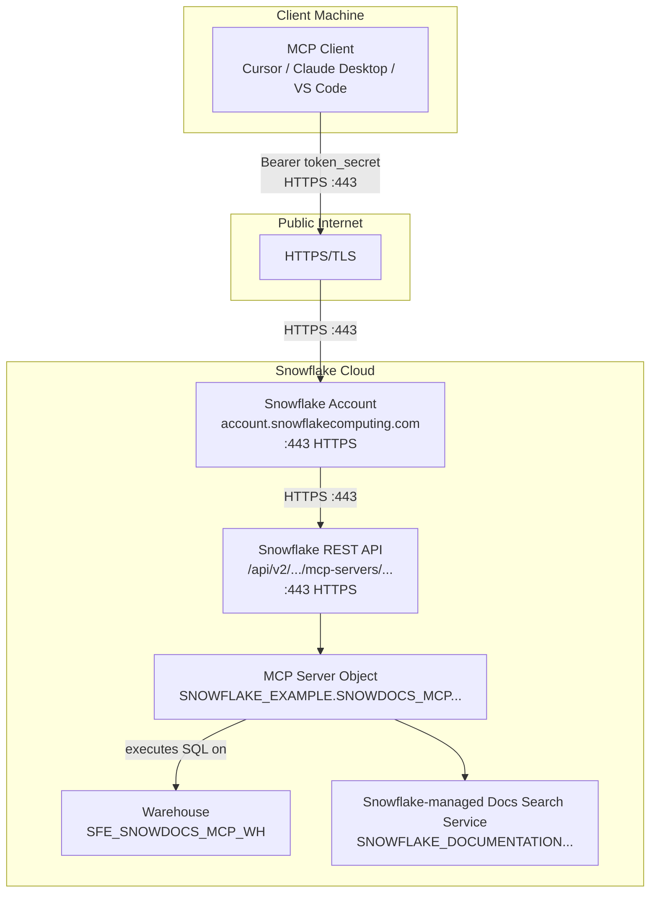

# Network Flow - Snowdocs MCP Server
Author: SE Community
Last Updated: 2026-01-09
Expires: 2026-02-07 (30 days from creation)
Status: Reference Implementation

Reference Implementation: This code demonstrates production-grade architectural patterns and best practices. Review and customize security, networking, and logic for your organization's specific requirements before deployment.

## Overview
This diagram shows the network path from an MCP client to Snowflake over HTTPS, and the internal Snowflake calls made by the MCP server tools (documentation search).

## Component Descriptions
- Purpose: MCP client
- Technology: IDE integration that speaks MCP over HTTP(S)
- Location: User workstation
- Deps: User config includes `MCP_URL` and `Authorization: Bearer <TOKEN_SECRET>`

- Purpose: Snowflake API endpoint
- Technology: Snowflake REST API (`/api/v2/.../mcp-servers/...`)
- Location: Snowflake account URL
- Deps: PAT token + role grants

- Purpose: Execution environment
- Technology: Snowflake warehouse (`SFE_SNOWDOCS_MCP_WH`)
- Location: Snowflake account
- Deps: Granted to access role; used for tool execution

- Purpose: Documentation search backend
- Technology: Snowflake-managed `SNOWFLAKE_DOCUMENTATION` + Cortex Search service
- Location: Snowflake-managed database
- Deps: Imported privileges granted to access role

## Change History
See `.cursor/DIAGRAM_CHANGELOG.md` for vhistory.
